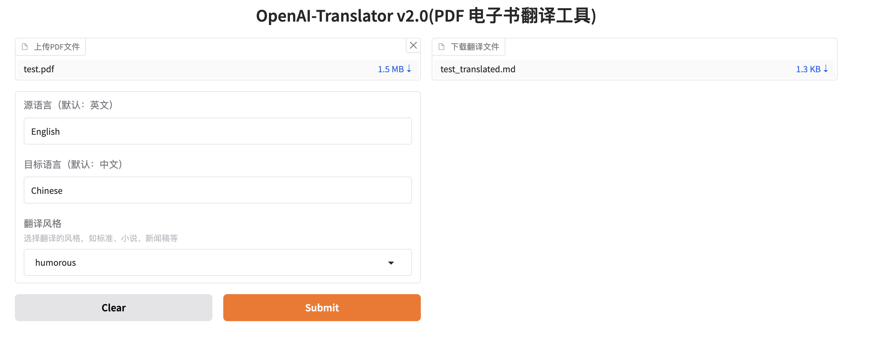

# OpenAI-Translator

<p align="center">
    <br> <a href="README.md"> English </a> | 中文
</p>
<p align="center">
    <em>所有的代码和文档完全由 OpenAI 的 GPT-4 模型生成</em>
</p>

## 介绍

OpenAI 翻译器是一个使用 AI 技术将英文 PDF 书籍翻译成中文的工具。这个工具使用了大型语言模型 (LLMs)，如 ChatGLM 和 OpenAI 的 GPT-3 以及 GPT-3.5 Turbo 来进行翻译。它是用 Python 构建的，并且具有灵活、模块化和面向对象的设计。

## 为什么做这个项目

在现今的环境中，缺乏非商业而且有效的 PDF 翻译工具。很多用户有包含敏感数据的 PDF 文件，他们更倾向于不将其上传到公共商业服务网站，以保护隐私。这个项目就是为了解决这个问题，为需要翻译他们的 PDF 文件同时又要保护数据隐私的用户提供解决方案。

## 示例结果

OpenAI 翻译器目前还处于早期开发阶段，我正在积极地添加更多功能和改进其性能。我们非常欢迎任何反馈或贡献！


<p align="center">
    <em>"老人与海"</em>
</p>

## 特性

- [X] 使用大型语言模型 (LLMs) 将英文 PDF 书籍翻译成中文。
- [X] 支持 ChatGLM 和 OpenAI 模型。
- [X] 通过 YAML 文件或命令行参数灵活配置。
- [X] 对健壮的翻译操作进行超时和错误处理。
- [X] 模块化和面向对象的设计，易于定制和扩展。
- [x] 添加对其他语言和翻译方向的支持。
- [x] 支持多种翻译风格选择（标准、小说、新闻、学术、口语化、诗歌、技术文档、幽默）。
- [ ] 实现图形用户界面 (GUI) 以便更易于使用。
- [ ] 创建一个网络服务或 API，以便在网络应用中使用。
- [ ] 添加对多个 PDF 文件的批处理支持。
- [ ] 添加对保留源 PDF 的原始布局和格式的支持。
- [ ] 通过使用自定义训练的翻译模型来提高翻译质量。

### 风格化翻译

OpenAI-Translator现在支持多种翻译风格，让您的翻译结果更加贴合特定场景的需求。通过Gradio图形化界面，您可以轻松选择以下翻译风格：

- **标准风格**：准确、客观地翻译原始内容，适合大多数翻译需求。
- **小说风格**：使用文学性的、富有表现力的语言，增强叙事流畅性，适合小说和故事类内容。
  *例如：*"He walked slowly down the street"（标准：他慢慢地走在街上）→（小说风格：他拖着疲惫的步伐，缓缓踱过这条布满回忆的街道）
- **新闻风格**：采用清晰、简洁、客观的语言，适合新闻报道或公告。
  *例如：*"The company announced new policies"（标准：公司宣布了新政策）→（新闻风格：据报道，该公司于昨日正式发布多项新政策，引发业内广泛关注）
- **学术风格**：使用正式、精确的术语和逻辑结构，适合学术论文和研究报告。
  *例如：*"This study shows"（标准：这项研究表明）→（学术风格：本研究结果显示，根据多变量分析...）
- **口语化风格**：使用日常会话中的表达方式，就像与朋友交谈一样，适合非正式内容。
  *例如：*"I disagree with this point"（标准：我不同意这一点）→（口语化：说实话，我觉得这观点不太靠谱）
- **诗歌风格**：注重韵律、意象和情感共鸣，适合诗歌或抒情内容。
  *例如：*"The sunset was beautiful"（标准：日落很美）→（诗歌风格：夕阳如血，染红天际，留下岁月的叹息）
- **技术文档风格**：使用精确的术语和清晰的解释，适合技术手册和文档。
  *例如：*"Click this button"（标准：点击这个按钮）→（技术风格：请用鼠标左键单击界面右上角的提交按钮以触发数据处理流程）
- **幽默风格**：融入机智和俏皮的语言，适合娱乐性内容。
  *例如：*"It was a difficult day"（标准：这是艰难的一天）→（幽默风格：今天过得简直像是被命运暴打了一顿，还不给医药费）

## Gradio界面



## 开始使用

### 环境准备

1.克隆仓库 `git clone git@github.com:DjangoPeng/openai-translator.git`。

2.OpenAI-翻译器 需要 Python 3.10 或更高版本。使用 `pip install -r requirements.txt` 安装依赖项。

3.设置您的 OpenAI API 密钥(`$OPENAI_API_KEY`)。您可以将其添加到环境变量中，或者在 config.yaml 文件中指定。

### 使用示例

您可以通过指定配置文件或提供命令行参数来使用 OpenAI-Translator 工具。

#### 使用配置文件

根据您的设置调整 `config.yaml` 文件：

```yaml
model_name: "gpt-3.5-turbo"
input_file: "tests/test.pdf"
output_file_format: "markdown"
source_language: "English"
target_language: "Chinese"
```

然后命令行直接运行：

```bash
python ai_translator/main.py
```


#### 使用命令行参数

您也可以直接在命令行上指定设置。这是使用 OpenAI 模型的例子：

```bash
# 将您的 api_key 设置为环境变量
export OPENAI_API_KEY="sk-xxx"
python ai_translator/main.py --model_name "gpt-3.5-turbo" --input_file "your_input.pdf" --output_file_format "markdown" --source_language "English" --target_language "Chinese"
```

#### 使用Gradio图形界面

我们现在提供了基于Gradio的图形界面，让翻译操作更加简单直观：

```bash
python ai_translator/gradio_server.py
```

在打开的界面中，您可以：
1. 上传PDF文件
2. 选择源语言和目标语言
3. 选择翻译风格（标准、小说、新闻等）
4. 点击翻译按钮开始翻译

## 许可证

该项目采用 GPL-3.0 许可证。有关详细信息，请查看 [LICENSE](LICENSE) 文件。


