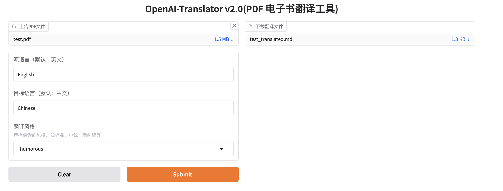

# OpenAI-Translator

<p align="center">
    <br> English | <a href="README-CN.md">中文</a>
</p>
<p align="center">
    <em>All the code and documentation are entirely generated by OpenAI's GPT-4 Model</em>
</p>


## Introduction

OpenAI Translator is an AI-powered translation tool designed to translate English PDF books to Chinese. The tool leverages large language models (LLMs) like ChatGLM and OpenAI's GPT-3 and GPT-3.5 Turbo for translation. It's built in Python and has a flexible, modular, and object-oriented design. 

## Why this project

In the current landscape, there's a lack of non-commercial yet efficient PDF translation tools. Many users have PDF documents with sensitive data that they prefer not to upload to public commercial service websites due to privacy concerns. This project was developed to address this gap, providing a solution for users who need to translate their PDFs while maintaining data privacy.

### Sample Results

The OpenAI Translator is still in its early stages of development, and I'm actively working on adding more features and improving its performance. We appreciate any feedback or contributions!


<p align="center">
    <em>"The Old Man and the Sea"</em>
</p>

## Features

- [X] Translation of English PDF books to Chinese using LLMs.
- [X] Support for both [ChatGLM](https://github.com/THUDM/ChatGLM-6B) and [OpenAI](https://platform.openai.com/docs/models) models.
- [X] Flexible configuration through a YAML file or command-line arguments.
- [X] Timeouts and error handling for robust translation operations.
- [X] Modular and object-oriented design for easy customization and extension.
- [x] Add support for other languages and translation directions.
- [x] Multiple translation styles (standard, novel, news, academic, casual, poetic, technical, humorous).
- [ ] Implement a graphical user interface (GUI) for easier use.
- [ ] Create a web service or API to enable usage in web applications.
- [ ] Add support for batch processing of multiple PDF files.
- [ ] Add support for preserving the original layout and formatting of the source PDF.
- [ ] Improve translation quality by using custom-trained translation models.

### Stylized Translation

OpenAI-Translator now supports various translation styles to make your translations better suit specific contexts. Through the Gradio graphical interface, you can easily choose from the following translation styles:

- **Standard Style**: Accurately and objectively translates the original content, suitable for most translation needs.
- **Novel Style**: Uses literary, expressive language with enhanced narrative flow, ideal for novels and stories.
  *Example:* "He walked slowly down the street" (Standard) → (Novel Style: "He dragged his weary feet, slowly pacing down the street filled with memories")
- **News Style**: Employs clear, concise, and objective language, suitable for news reports or announcements.
  *Example:* "The company announced new policies" (Standard) → (News Style: "According to reports, the company officially released several new policies yesterday, generating widespread attention in the industry")
- **Academic Style**: Uses formal language, precise terminology, and logical structure, perfect for academic papers and research reports.
  *Example:* "This study shows" (Standard) → (Academic Style: "The results of this study indicate that, according to multivariate analysis...")
- **Casual Style**: Uses expressions from everyday conversations, as if talking to a friend, suitable for informal content.
  *Example:* "I disagree with this point" (Standard) → (Casual Style: "Honestly, I think this point doesn't really hold water")
- **Poetic Style**: Focuses on rhythm, imagery, and emotional resonance, ideal for poetry or lyrical content.
  *Example:* "The sunset was beautiful" (Standard) → (Poetic Style: "The sunset like blood, painting the horizon crimson, leaving behind the sighs of time")
- **Technical Style**: Uses precise terminology and clear explanations, suitable for technical manuals and documentation.
  *Example:* "Click this button" (Standard) → (Technical Style: "Use the left mouse button to click the submit button in the upper right corner of the interface to trigger the data processing workflow")
- **Humorous Style**: Incorporates wit and playfulness, suitable for entertaining content.
  *Example:* "It was a difficult day" (Standard) → (Humorous Style: "Today felt like being beaten up by fate, and not even getting medical compensation")

## Gradio Interface



## Getting Started

### Environment Setup

1.Clone the repository `git clone git@github.com:DjangoPeng/openai-translator.git`.

2.The `OpenAI-Translator` requires Python 3.10 or later. Install the dependencies with `pip install -r requirements.txt`.

3.Set up your OpenAI API key(`$OPENAI_API_KEY`). You can either add it to your environment variables or specify it in the config.yaml file.

### Usage

You can use OpenAI-Translator either by specifying a configuration file or by providing command-line arguments.

#### Using a configuration file:

Adapt `config.yaml` file with your settings:

```yaml
model_name: "gpt-3.5-turbo"
input_file: "tests/test.pdf"
output_file_format: "markdown"
source_language: "English"
target_language: "Chinese"
```

Then run the tool:

```bash
python ai_translator/main.py
```


#### Using command-line arguments:

You can also specify the settings directly on the command line. Here's an example of how to use the OpenAI model:

```bash
# Set your api_key as an env variable
export OPENAI_API_KEY="sk-xxx"
python ai_translator/main.py --model_name "gpt-3.5-turbo" --input_file "your_input.pdf" --output_file_format "markdown" --source_language "English" --target_language "Chinese"
```

#### Using the Gradio Graphical Interface:

We now provide a Gradio-based graphical interface to make translation operations simpler and more intuitive:

```bash
python ai_translator/gradio_server.py
```

In the opened interface, you can:
1. Upload a PDF file
2. Select source and target languages
3. Choose a translation style (standard, novel, news, etc.)
4. Click the translate button to start translation

## License

This project is licensed under the GPL-3.0 License. See the [LICENSE](LICENSE) file for details.